# FTC Tournament Management System (RMS)

A console-based ranking management system for FIRST Tech Challenge (FTC) robotics tournaments.

---

## Table of Contents

- [Overview](#overview)
- [Features](#features)
- [Project Structure](#project-structure)
- [Data Structures](#data-structures)
- [Workflow Diagram](#workflow-diagram)
- [Menu Options](#menu-options)
- [File Formats](#file-formats)
- [Build & Run](#build--run)
- [Usage Guide](#usage-guide)
- [Ranking System](#ranking-system)

---

## Overview

The RMS (Ranking Management System) is a lightweight C application that manages:
- Team registration and data
- Match scheduling and queue management
- Score entry and results tracking
- Live rankings calculation and export

All data is persisted in CSV files for easy viewing and portability.

---

## Features

- **Team Management** - Import teams from CSV, store in linked list
- **Match Schedule** - Load matches, track pending/played status
- **Score Entry** - Play matches sequentially, record scores
- **Rankings** - Auto-calculate standings by Ranking Points
- **Export** - Save rankings to CSV for distribution

---

## Project Structure

```
rms_project/
├── Makefile              # Build configuration
├── include/
│   └── tournament.h      # Header: structs, enums, function declarations
├── src/
│   ├── main.c            # Entry point, main menu loop
│   ├── team.c            # Team creation, search, stats update
│   ├── match.c           # Match management, score entry, display
│   ├── queue.c           # FIFO queue for pending matches
│   ├── ranking.c         # Sorting and display logic
│   └── file_io.c         # CSV read/write operations
└── data/
    ├── teams.csv         # Team database
    ├── matches.csv       # Match schedule
    ├── results.csv       # Completed match results
    └── rankings.csv      # Exported standings
```

---

## Data Structures

### Team (Singly Linked List)
```c
typedef struct Team {
    int    id;
    char   name[MAX_NAME_LEN];
    int    ranking_points;
    int    matches_played;
    int    wins, ties, losses;
    int    total_score;
    struct Team *next;
} Team;
```

### Match (Singly Linked List)
```c
typedef struct Match {
    int         match_num;
    int         red_team_id;
    int         blue_team_id;
    int         red_score;
    int         blue_score;
    MatchStatus status;   // PENDING or PLAYED
    struct Match *next;
} Match;
```

### Match Queue (FIFO)
```c
typedef struct {
    QueueNode *front;
    QueueNode *rear;
    int        size;
} MatchQueue;
```

---

## Workflow Diagrams

### High-Level Architecture

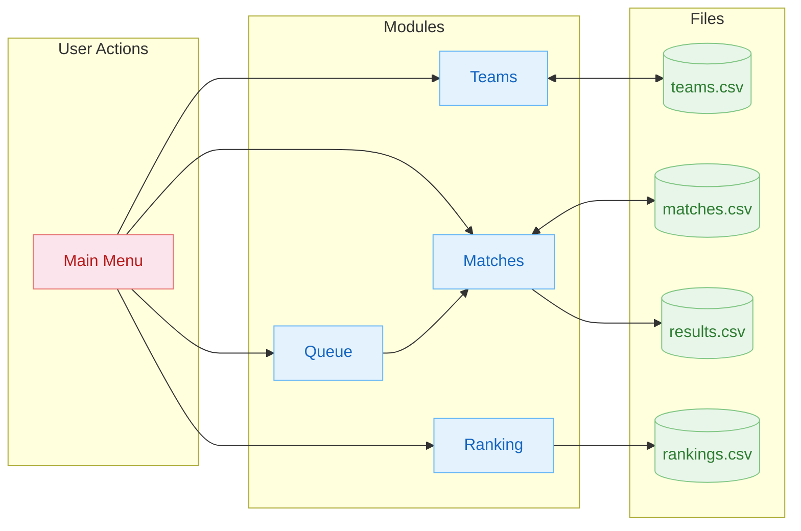
```mermaid
flowchart LR
    classDef userStyle fill:#fce4ec,stroke:#e57373,color:#b71c1c
    classDef modStyle fill:#e3f2fd,stroke:#64b5f6,color:#1565c0
    classDef fileStyle fill:#e8f5e9,stroke:#81c784,color:#2e7d32

    subgraph User["User Actions"]
        Menu[Main Menu]:::userStyle
    end
    
    subgraph Modules["Modules"]
        Teams[Teams]:::modStyle
        Matches[Matches]:::modStyle
        Queue[Queue]:::modStyle
        Ranking[Ranking]:::modStyle
    end
    
    subgraph Files["Files"]
        T[(teams.csv)]:::fileStyle
        M[(matches.csv)]:::fileStyle
        R[(results.csv)]:::fileStyle
        K[(rankings.csv)]:::fileStyle
    end
    
    Menu --> Teams
    Menu --> Matches
    Menu --> Queue
    Menu --> Ranking
    
    Teams <--> T
    Matches <--> M
    Matches --> R
    Ranking --> K
    Queue --> Matches
```

---

### 1. Import Teams

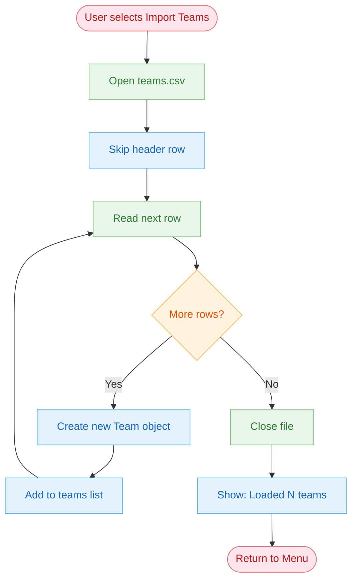
```mermaid
flowchart TD
    classDef startEnd fill:#fce4ec,stroke:#e57373,color:#b71c1c
    classDef process fill:#e3f2fd,stroke:#64b5f6,color:#1565c0
    classDef decision fill:#fff3e0,stroke:#ffb74d,color:#e65100
    classDef io fill:#e8f5e9,stroke:#81c784,color:#2e7d32

    Start([User selects Import Teams]):::startEnd --> OpenFile[Open teams.csv]:::io
    OpenFile --> SkipHeader[Skip header row]:::process
    SkipHeader --> ReadRow[Read next row]:::io
    ReadRow --> MoreRows{More rows?}:::decision
    
    MoreRows -->|Yes| CreateTeam[Create new Team object]:::process
    CreateTeam --> AddToList[Add to teams list]:::process
    AddToList --> ReadRow
    
    MoreRows -->|No| CloseFile[Close file]:::io
    CloseFile --> ShowCount[Show: Loaded N teams]:::process
    ShowCount --> Done([Return to Menu]):::startEnd
```

---

### 2. Import Match Schedule

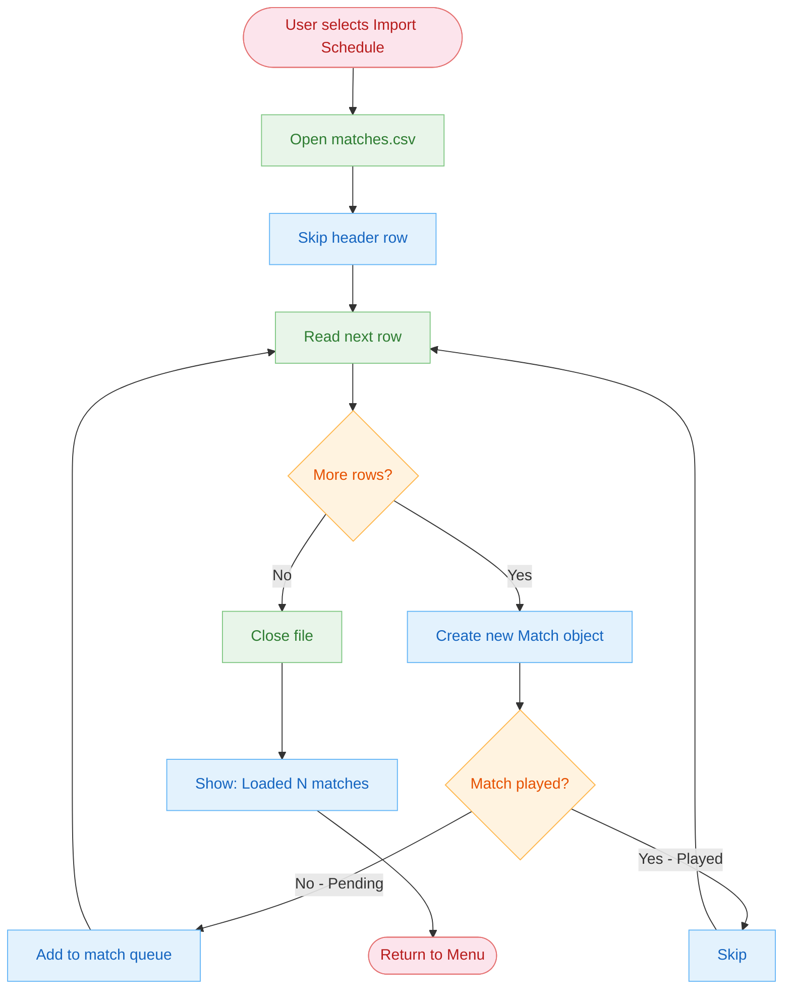
```mermaid
flowchart TD
    classDef startEnd fill:#fce4ec,stroke:#e57373,color:#b71c1c
    classDef process fill:#e3f2fd,stroke:#64b5f6,color:#1565c0
    classDef decision fill:#fff3e0,stroke:#ffb74d,color:#e65100
    classDef io fill:#e8f5e9,stroke:#81c784,color:#2e7d32

    Start([User selects Import Schedule]):::startEnd --> OpenFile[Open matches.csv]:::io
    OpenFile --> SkipHeader[Skip header row]:::process
    SkipHeader --> ReadRow[Read next row]:::io
    ReadRow --> MoreRows{More rows?}:::decision
    
    MoreRows -->|Yes| CreateMatch[Create new Match object]:::process
    CreateMatch --> CheckStatus{Match played?}:::decision
    
    CheckStatus -->|No - Pending| AddToQueue[Add to match queue]:::process
    CheckStatus -->|Yes - Played| Skip[Skip]:::process
    
    AddToQueue --> ReadRow
    Skip --> ReadRow
    
    MoreRows -->|No| CloseFile[Close file]:::io
    CloseFile --> ShowCount[Show: Loaded N matches]:::process
    ShowCount --> Done([Return to Menu]):::startEnd
```

---

### 3. Play Next Match


```mermaid
flowchart LR
    classDef startEnd fill:#fce4ec,stroke:#e57373,color:#b71c1c
    classDef process fill:#e3f2fd,stroke:#64b5f6,color:#1565c0
    classDef decision fill:#fff3e0,stroke:#ffb74d,color:#e65100
    classDef io fill:#e8f5e9,stroke:#81c784,color:#2e7d32
    classDef warn fill:#ffebee,stroke:#ef5350,color:#c62828

    Start([User selects Play Match]):::startEnd --> CheckTeams{Teams loaded?}:::decision
    
    CheckTeams -->|No| ShowErr[Show: Load teams first]:::warn
    ShowErr --> Done([Return to Menu]):::startEnd
    
    CheckTeams -->|Yes| CheckQueue{Matches left?}:::decision
    
    CheckQueue -->|No| ShowAll[Show: All matches played]:::warn
    ShowAll --> Done
    
    CheckQueue -->|Yes| GetMatch[Get next match from queue]:::process
    GetMatch --> ShowTeams[Display: Team A vs Team B]:::io
    
    ShowTeams --> AskRed[Ask: Enter RED score]:::io
    AskRed --> GetRed[User enters RED score]:::io
    GetRed --> AskBlue[Ask: Enter BLUE score]:::io
    AskBlue --> GetBlue[User enters BLUE score]:::io
    
    GetBlue --> UpdateMatch[Update match with scores]:::process
    UpdateMatch --> UpdateRed[Update RED team stats]:::process
    UpdateRed --> UpdateBlue[Update BLUE team stats]:::process
    UpdateBlue --> LogResult[Save to results.csv]:::io
    LogResult --> ShowDone[Show: Score recorded]:::process
    ShowDone --> Done
```

---

### 4. View Schedule & Results

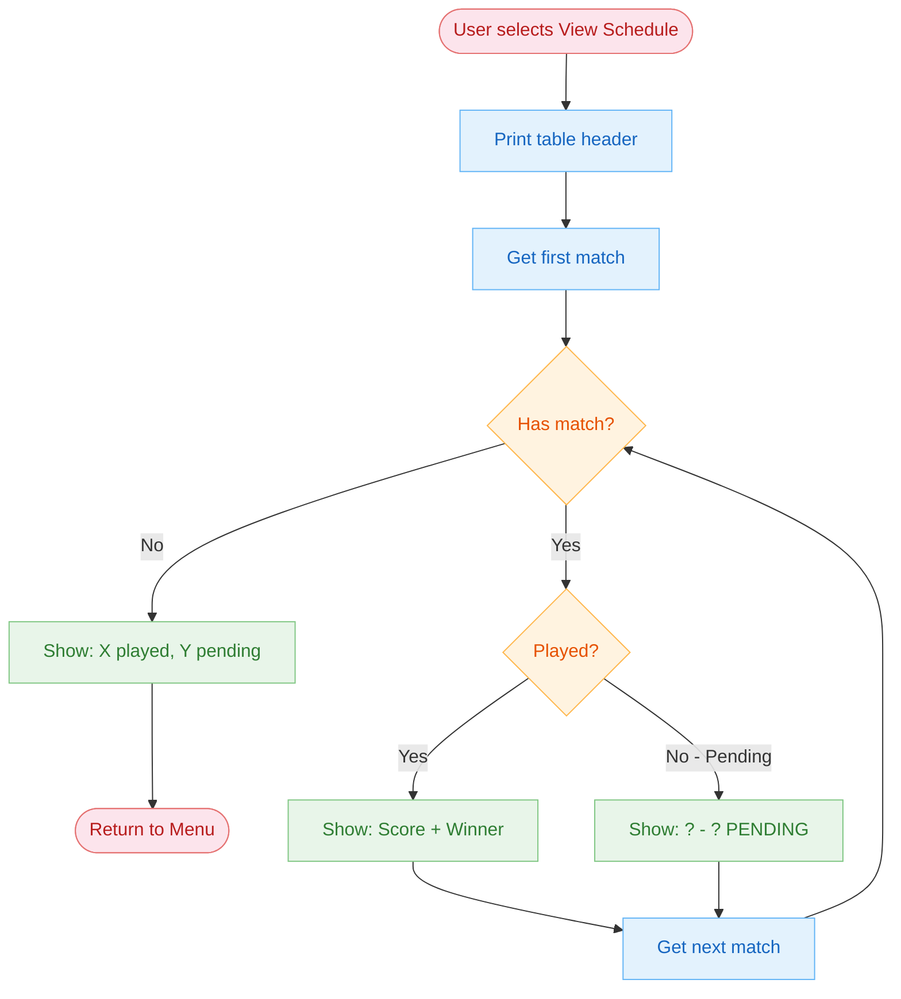
```mermaid
flowchart TD
    classDef startEnd fill:#fce4ec,stroke:#e57373,color:#b71c1c
    classDef process fill:#e3f2fd,stroke:#64b5f6,color:#1565c0
    classDef decision fill:#fff3e0,stroke:#ffb74d,color:#e65100
    classDef io fill:#e8f5e9,stroke:#81c784,color:#2e7d32

    Start([User selects View Schedule]):::startEnd --> PrintHeader[Print table header]:::process
    PrintHeader --> GetFirst[Get first match]:::process
    GetFirst --> HasMatch{Has match?}:::decision
    
    HasMatch -->|No| ShowSummary[Show: X played, Y pending]:::io
    ShowSummary --> Done([Return to Menu]):::startEnd
    
    HasMatch -->|Yes| CheckStatus{Played?}:::decision
    
    CheckStatus -->|Yes| ShowPlayed[Show: Score + Winner]:::io
    CheckStatus -->|No - Pending| ShowPending[Show: ? - ? PENDING]:::io
    
    ShowPlayed --> GetNext[Get next match]:::process
    ShowPending --> GetNext
    
    GetNext --> HasMatch
```

---

### 5. View Rankings

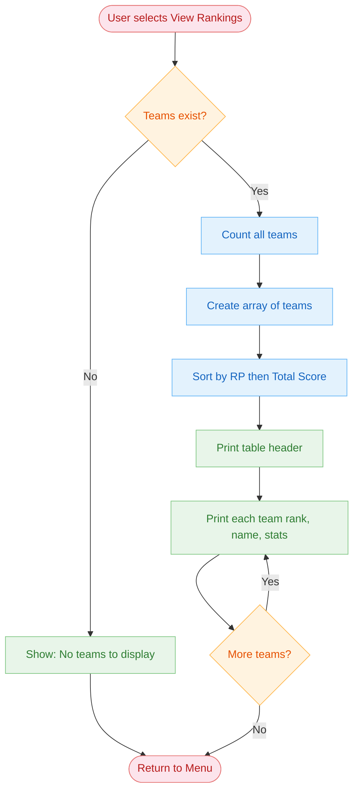
```mermaid
flowchart TD
    classDef startEnd fill:#fce4ec,stroke:#e57373,color:#b71c1c
    classDef process fill:#e3f2fd,stroke:#64b5f6,color:#1565c0
    classDef decision fill:#fff3e0,stroke:#ffb74d,color:#e65100
    classDef io fill:#e8f5e9,stroke:#81c784,color:#2e7d32

    Start([User selects View Rankings]):::startEnd --> CheckTeams{Teams exist?}:::decision
    
    CheckTeams -->|No| ShowNone[Show: No teams to display]:::io
    ShowNone --> Done([Return to Menu]):::startEnd
    
    CheckTeams -->|Yes| CountTeams[Count all teams]:::process
    CountTeams --> CreateArray[Create array of teams]:::process
    CreateArray --> Sort[Sort by RP then Total Score]:::process
    Sort --> PrintHeader[Print table header]:::io
    PrintHeader --> PrintRow[Print each team rank, name, stats]:::io
    PrintRow --> MoreTeams{More teams?}:::decision
    
    MoreTeams -->|Yes| PrintRow
    MoreTeams -->|No| Done([Return to Menu]):::startEnd
```

---

### 6. Export Rankings

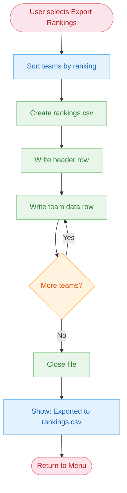
```mermaid
flowchart TD
    classDef startEnd fill:#fce4ec,stroke:#e57373,color:#b71c1c
    classDef process fill:#e3f2fd,stroke:#64b5f6,color:#1565c0
    classDef decision fill:#fff3e0,stroke:#ffb74d,color:#e65100
    classDef io fill:#e8f5e9,stroke:#81c784,color:#2e7d32

    Start([User selects Export Rankings]):::startEnd --> Sort[Sort teams by ranking]:::process
    Sort --> CreateFile[Create rankings.csv]:::io
    CreateFile --> WriteHeader[Write header row]:::io
    WriteHeader --> WriteRow[Write team data row]:::io
    WriteRow --> MoreTeams{More teams?}:::decision
    
    MoreTeams -->|Yes| WriteRow
    MoreTeams -->|No| CloseFile[Close file]:::io
    CloseFile --> ShowMsg[Show: Exported to rankings.csv]:::process
    ShowMsg --> Done([Return to Menu]):::startEnd
```

---

### 7. Exit Application

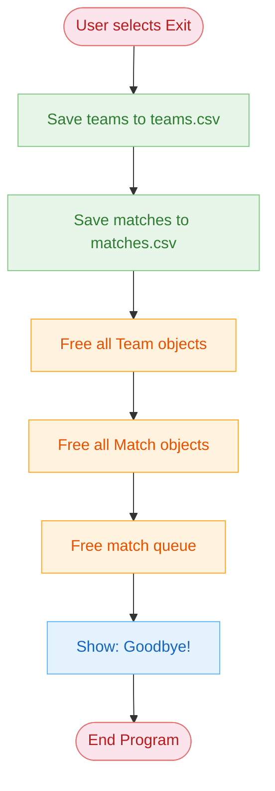
```mermaid
flowchart TD
    classDef startEnd fill:#fce4ec,stroke:#e57373,color:#b71c1c
    classDef process fill:#e3f2fd,stroke:#64b5f6,color:#1565c0
    classDef io fill:#e8f5e9,stroke:#81c784,color:#2e7d32
    classDef free fill:#fff3e0,stroke:#ffa726,color:#e65100

    Start([User selects Exit]):::startEnd --> SaveTeams[Save teams to teams.csv]:::io
    SaveTeams --> SaveMatches[Save matches to matches.csv]:::io
    SaveMatches --> FreeTeams[Free all Team objects]:::free
    FreeTeams --> FreeMatches[Free all Match objects]:::free
    FreeMatches --> FreeQueue[Free match queue]:::free
    FreeQueue --> ShowBye[Show: Goodbye!]:::process
    ShowBye --> Done([End Program]):::startEnd
```

---

## Detailed Feature Workflows

### 8. Update Team Stats (After Match)

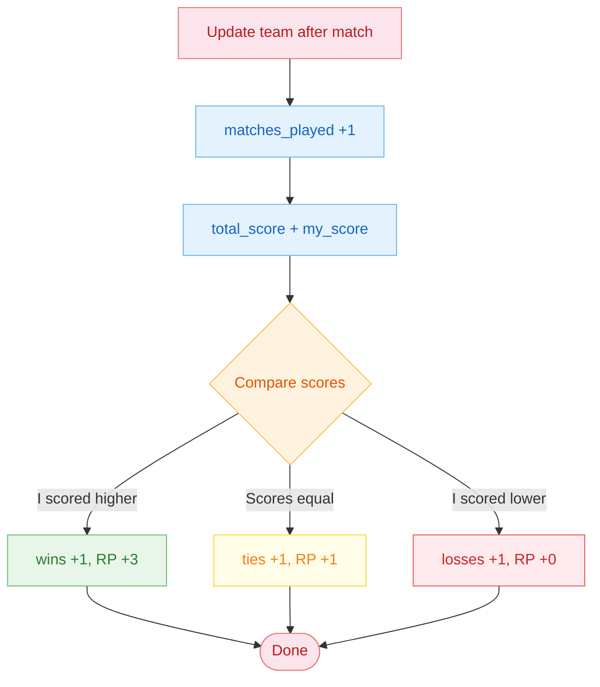
```mermaid
flowchart TD
    classDef startEnd fill:#fce4ec,stroke:#e57373,color:#b71c1c
    classDef process fill:#e3f2fd,stroke:#64b5f6,color:#1565c0
    classDef decision fill:#fff3e0,stroke:#ffb74d,color:#e65100
    classDef win fill:#e8f5e9,stroke:#66bb6a,color:#2e7d32
    classDef tie fill:#fffde7,stroke:#fdd835,color:#f57f17
    classDef loss fill:#ffebee,stroke:#ef5350,color:#c62828

    Start[Update team after match]:::startEnd --> AddPlayed[matches_played +1]:::process
    AddPlayed --> AddScore[total_score + my_score]:::process
    AddScore --> Compare{Compare scores}:::decision
    
    Compare -->|I scored higher| WinCase[wins +1, RP +3]:::win
    Compare -->|Scores equal| TieCase[ties +1, RP +1]:::tie
    Compare -->|I scored lower| LossCase[losses +1, RP +0]:::loss
    
    WinCase --> Done([Done]):::startEnd
    TieCase --> Done
    LossCase --> Done
```

---

### 9. Add Match to Queue

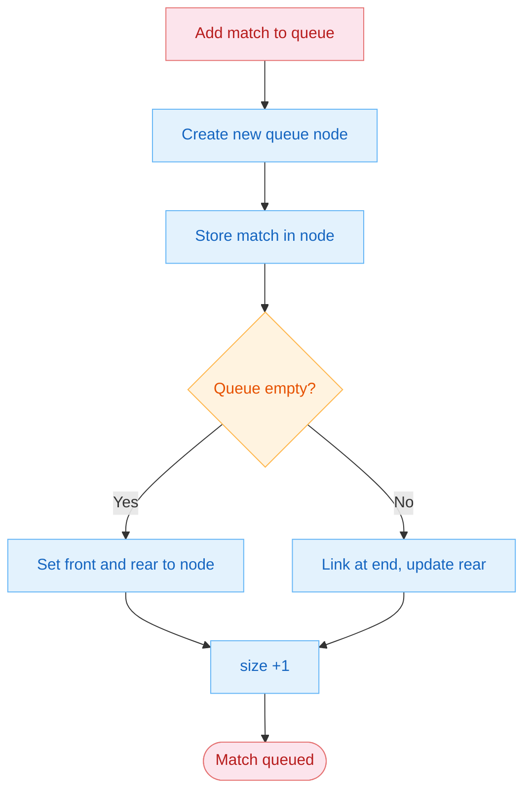
```mermaid
flowchart TD
    classDef startEnd fill:#fce4ec,stroke:#e57373,color:#b71c1c
    classDef process fill:#e3f2fd,stroke:#64b5f6,color:#1565c0
    classDef decision fill:#fff3e0,stroke:#ffb74d,color:#e65100

    Start[Add match to queue]:::startEnd --> CreateNode[Create new queue node]:::process
    CreateNode --> SetMatch[Store match in node]:::process
    SetMatch --> EmptyQ{Queue empty?}:::decision
    
    EmptyQ -->|Yes| SetBoth[Set front and rear to node]:::process
    EmptyQ -->|No| Link[Link at end, update rear]:::process
    
    SetBoth --> IncSize[size +1]:::process
    Link --> IncSize
    
    IncSize --> Done([Match queued]):::startEnd
```

---

### 10. Get Next Match from Queue

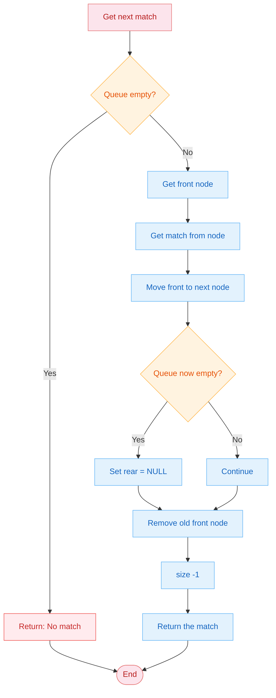
```mermaid
flowchart TD
    classDef startEnd fill:#fce4ec,stroke:#e57373,color:#b71c1c
    classDef process fill:#e3f2fd,stroke:#64b5f6,color:#1565c0
    classDef decision fill:#fff3e0,stroke:#ffb74d,color:#e65100
    classDef warn fill:#ffebee,stroke:#ef5350,color:#c62828

    Start[Get next match]:::startEnd --> EmptyQ{Queue empty?}:::decision
    
    EmptyQ -->|Yes| NoMatch[Return: No match]:::warn
    NoMatch --> Done([End]):::startEnd
    
    EmptyQ -->|No| GetNode[Get front node]:::process
    GetNode --> GetMatch[Get match from node]:::process
    GetMatch --> MoveFront[Move front to next node]:::process
    MoveFront --> CheckEmpty{Queue now empty?}:::decision
    
    CheckEmpty -->|Yes| SetRear[Set rear = NULL]:::process
    CheckEmpty -->|No| Skip[Continue]:::process
    
    SetRear --> RemoveNode[Remove old front node]:::process
    Skip --> RemoveNode
    
    RemoveNode --> DecSize[size -1]:::process
    DecSize --> Return[Return the match]:::process
    Return --> Done([End]):::startEnd
```

---

### 11. Determine Match Winner

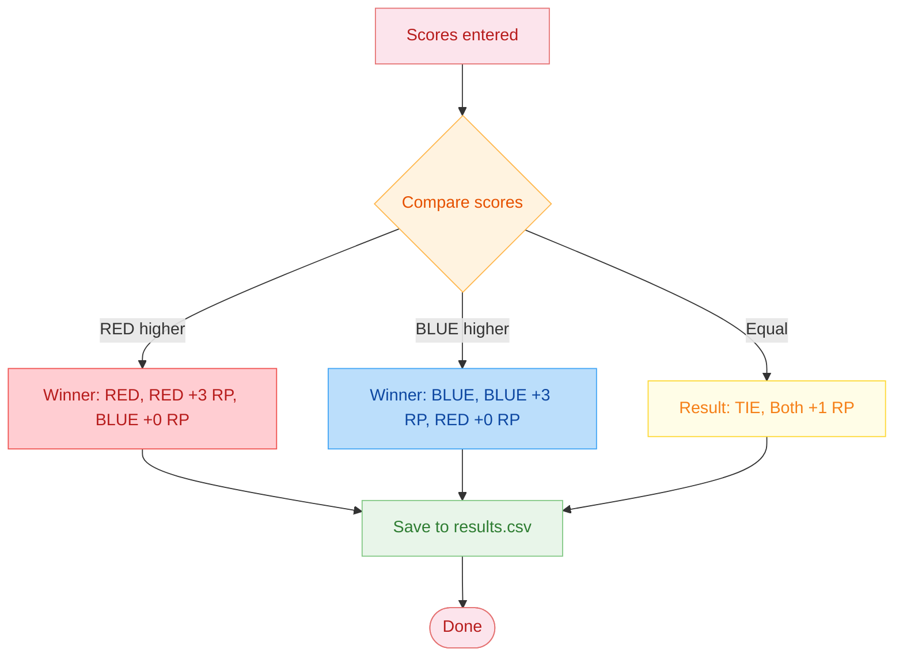
```mermaid
flowchart TD
    classDef startEnd fill:#fce4ec,stroke:#e57373,color:#b71c1c
    classDef process fill:#e3f2fd,stroke:#64b5f6,color:#1565c0
    classDef decision fill:#fff3e0,stroke:#ffb74d,color:#e65100
    classDef red fill:#ffcdd2,stroke:#ef5350,color:#b71c1c
    classDef blue fill:#bbdefb,stroke:#42a5f5,color:#0d47a1
    classDef tie fill:#fffde7,stroke:#fdd835,color:#f57f17
    classDef io fill:#e8f5e9,stroke:#81c784,color:#2e7d32

    Start[Scores entered]:::startEnd --> Compare{Compare scores}:::decision
    
    Compare -->|RED higher| RedWin[Winner: RED, RED +3 RP, BLUE +0 RP]:::red
    Compare -->|BLUE higher| BlueWin[Winner: BLUE, BLUE +3 RP, RED +0 RP]:::blue
    Compare -->|Equal| Tie[Result: TIE, Both +1 RP]:::tie
    
    RedWin --> Log[Save to results.csv]:::io
    BlueWin --> Log
    Tie --> Log
    
    Log --> Done([Done]):::startEnd
```

---

### 12. Sort Teams for Rankings

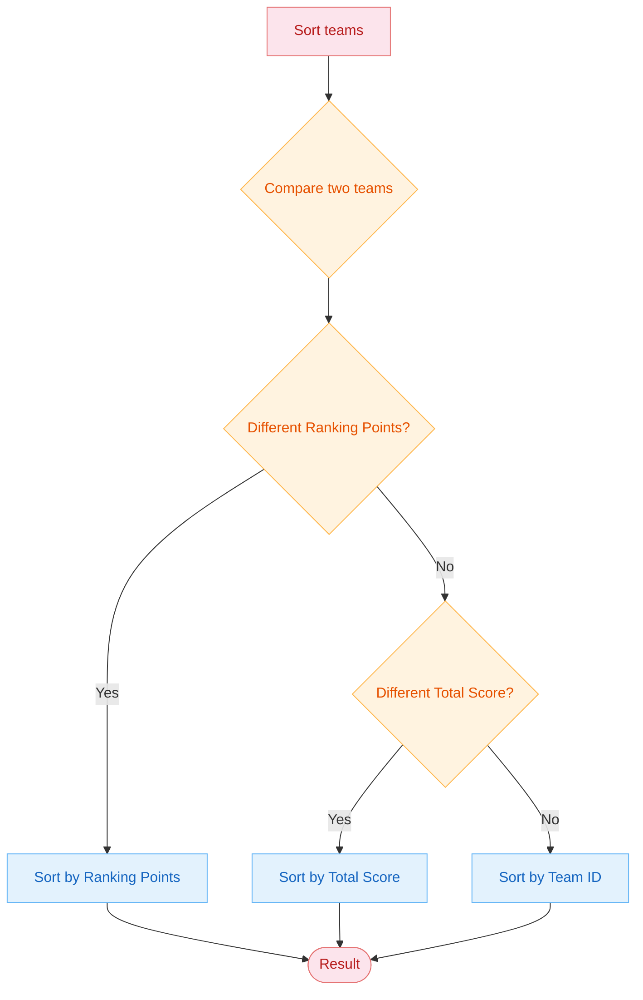
```mermaid
flowchart TD
    classDef startEnd fill:#fce4ec,stroke:#e57373,color:#b71c1c
    classDef process fill:#e3f2fd,stroke:#64b5f6,color:#1565c0
    classDef decision fill:#fff3e0,stroke:#ffb74d,color:#e65100

    Start[Sort teams]:::startEnd --> Compare{Compare two teams}:::decision
    
    Compare --> DiffRP{Different Ranking Points?}:::decision
    DiffRP -->|Yes| ByRP[Sort by Ranking Points]:::process
    ByRP --> Done([Result]):::startEnd
    
    DiffRP -->|No| DiffScore{Different Total Score?}:::decision
    DiffScore -->|Yes| ByScore[Sort by Total Score]:::process
    ByScore --> Done
    
    DiffScore -->|No| ByID[Sort by Team ID]:::process
    ByID --> Done
```

---

### 13. Find Team by ID

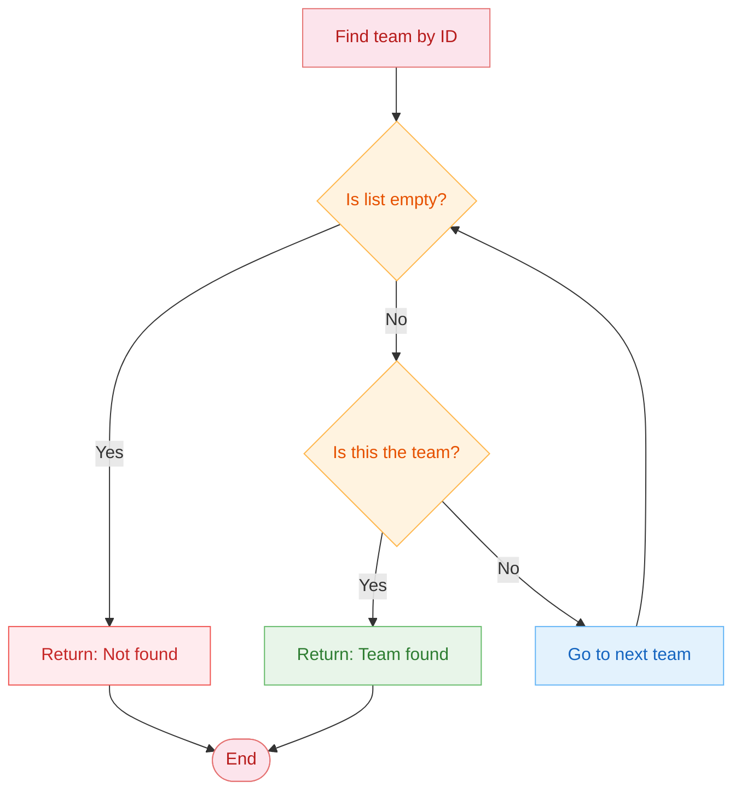
```mermaid
flowchart TD
    classDef startEnd fill:#fce4ec,stroke:#e57373,color:#b71c1c
    classDef process fill:#e3f2fd,stroke:#64b5f6,color:#1565c0
    classDef decision fill:#fff3e0,stroke:#ffb74d,color:#e65100
    classDef win fill:#e8f5e9,stroke:#66bb6a,color:#2e7d32
    classDef warn fill:#ffebee,stroke:#ef5350,color:#c62828

    Start[Find team by ID]:::startEnd --> First{Is list empty?}:::decision
    
    First -->|Yes| NotFound[Return: Not found]:::warn
    NotFound --> Done([End]):::startEnd
    
    First -->|No| CheckId{Is this the team?}:::decision
    
    CheckId -->|Yes| Found[Return: Team found]:::win
    Found --> Done
    
    CheckId -->|No| Next[Go to next team]:::process
    Next --> First
```

---

### 14. Load Teams from File

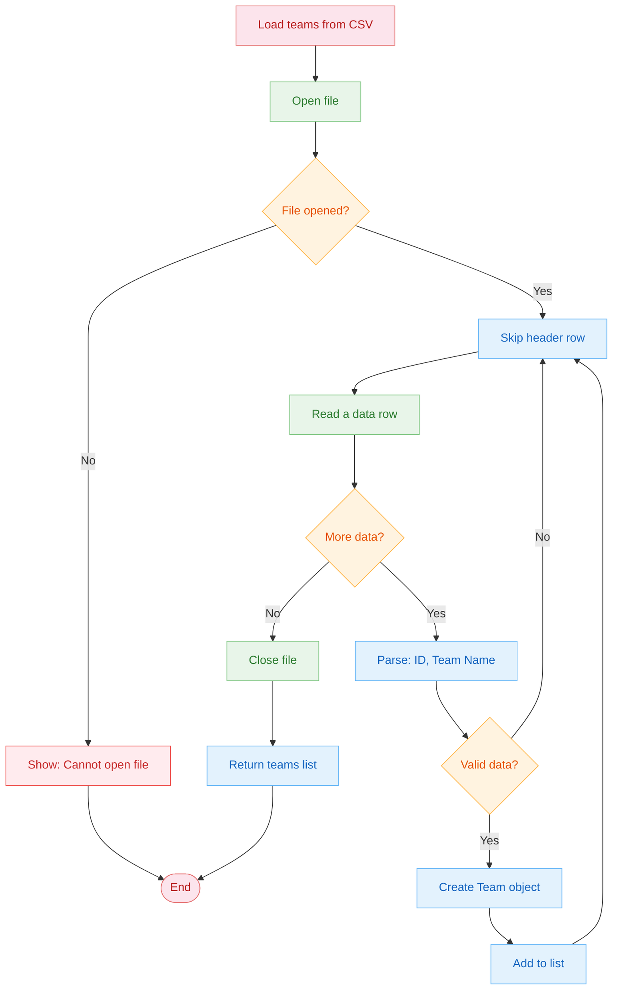
```mermaid
flowchart TD
    classDef startEnd fill:#fce4ec,stroke:#e57373,color:#b71c1c
    classDef process fill:#e3f2fd,stroke:#64b5f6,color:#1565c0
    classDef decision fill:#fff3e0,stroke:#ffb74d,color:#e65100
    classDef io fill:#e8f5e9,stroke:#81c784,color:#2e7d32
    classDef warn fill:#ffebee,stroke:#ef5350,color:#c62828

    Start[Load teams from CSV]:::startEnd --> OpenFile[Open file]:::io
    OpenFile --> CheckOpen{File opened?}:::decision
    
    CheckOpen -->|No| ShowErr[Show: Cannot open file]:::warn
    ShowErr --> Done([End]):::startEnd
    
    CheckOpen -->|Yes| SkipHdr[Skip header row]:::process
    SkipHdr --> ReadRow[Read a data row]:::io
    ReadRow --> MoreData{More data?}:::decision
    
    MoreData -->|No| CloseFile[Close file]:::io
    CloseFile --> RetList[Return teams list]:::process
    RetList --> Done
    
    MoreData -->|Yes| Parse[Parse: ID, Team Name]:::process
    Parse --> Valid{Valid data?}:::decision
    
    Valid -->|No| SkipHdr
    Valid -->|Yes| Create[Create Team object]:::process
    Create --> Add[Add to list]:::process
    Add --> SkipHdr
```

---

### 15. Save Match Result

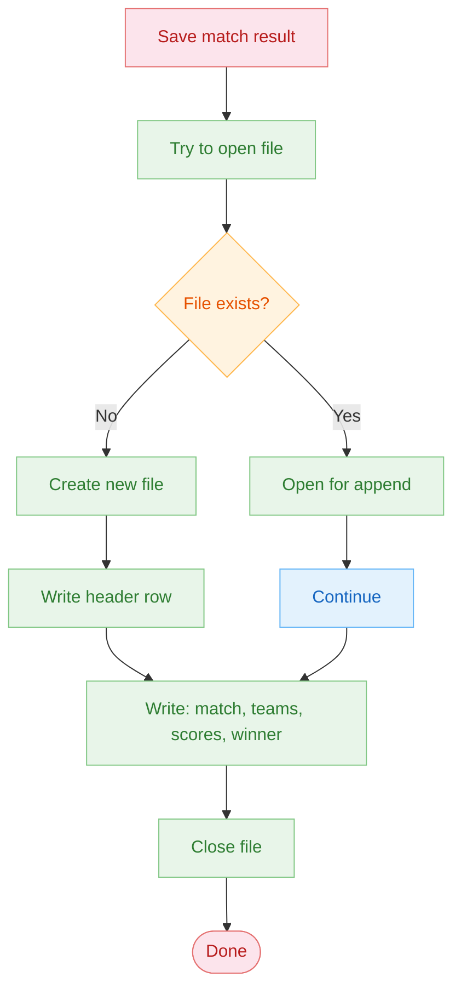
```mermaid
flowchart TD
    classDef startEnd fill:#fce4ec,stroke:#e57373,color:#b71c1c
    classDef process fill:#e3f2fd,stroke:#64b5f6,color:#1565c0
    classDef decision fill:#fff3e0,stroke:#ffb74d,color:#e65100
    classDef io fill:#e8f5e9,stroke:#81c784,color:#2e7d32

    Start[Save match result]:::startEnd --> OpenFile[Try to open file]:::io
    OpenFile --> Exists{File exists?}:::decision
    
    Exists -->|No| Create[Create new file]:::io
    Create --> WriteHdr[Write header row]:::io
    
    Exists -->|Yes| Append[Open for append]:::io
    Append --> Skip[Continue]:::process
    
    WriteHdr --> WriteRow[Write: match, teams, scores, winner]:::io
    Skip --> WriteRow
    
    WriteRow --> Close[Close file]:::io
    Close --> Done([Done]):::startEnd
```

---

### 16. Save Teams to File

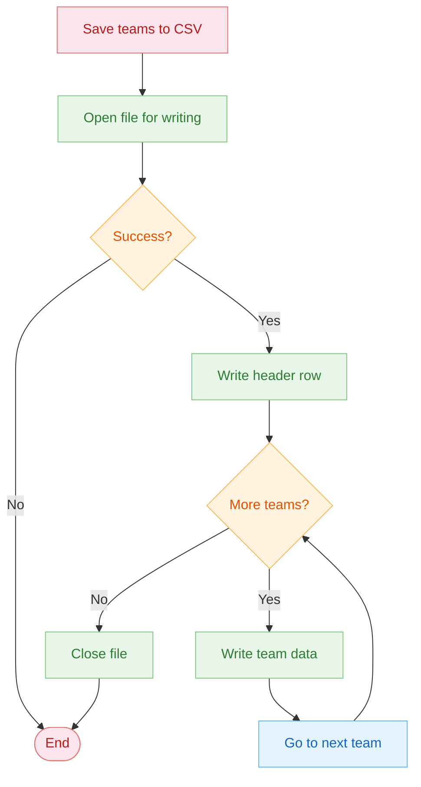
```mermaid
flowchart TD
    classDef startEnd fill:#fce4ec,stroke:#e57373,color:#b71c1c
    classDef process fill:#e3f2fd,stroke:#64b5f6,color:#1565c0
    classDef decision fill:#fff3e0,stroke:#ffb74d,color:#e65100
    classDef io fill:#e8f5e9,stroke:#81c784,color:#2e7d32

    Start[Save teams to CSV]:::startEnd --> OpenFile[Open file for writing]:::io
    OpenFile --> CheckOpen{Success?}:::decision
    
    CheckOpen -->|No| Done([End]):::startEnd
    CheckOpen -->|Yes| WriteHdr[Write header row]:::io
    
    WriteHdr --> MoreTeams{More teams?}:::decision
    
    MoreTeams -->|Yes| WriteRow[Write team data]:::io
    WriteRow --> NextTeam[Go to next team]:::process
    NextTeam --> MoreTeams
    
    MoreTeams -->|No| Close[Close file]:::io
    Close --> Done
```

---

### 17. Build Queue from Matches

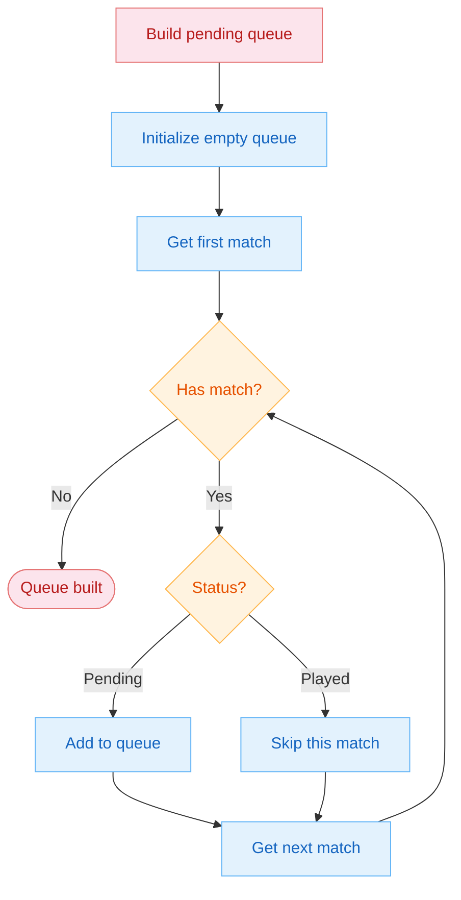
```mermaid
flowchart TD
    classDef startEnd fill:#fce4ec,stroke:#e57373,color:#b71c1c
    classDef process fill:#e3f2fd,stroke:#64b5f6,color:#1565c0
    classDef decision fill:#fff3e0,stroke:#ffb74d,color:#e65100

    Start[Build pending queue]:::startEnd --> Init[Initialize empty queue]:::process
    Init --> GetFirst[Get first match]:::process
    GetFirst --> HasMatch{Has match?}:::decision
    
    HasMatch -->|No| Done([Queue built]):::startEnd
    
    HasMatch -->|Yes| CheckStatus{Status?}:::decision
    
    CheckStatus -->|Pending| Enqueue[Add to queue]:::process
    CheckStatus -->|Played| Skip[Skip this match]:::process
    
    Enqueue --> GetNext[Get next match]:::process
    Skip --> GetNext
    
    GetNext --> HasMatch
```

---

## Menu Options

| Option | Action | Description |
|--------|--------|-------------|
| [1] | Import Teams | Load teams from `data/teams.csv` |
| [2] | Import Schedule | Load matches from `data/matches.csv` |
| [3] | Play Next Match | Dequeue match, enter scores, update stats |
| [4] | View Schedule & Results | Show all matches with status |
| [5] | View Rankings | Display sorted standings table |
| [6] | Export Rankings | Save rankings to `data/rankings.csv` |
| [7] | Exit | Save data and quit |

---

## File Formats

### teams.csv
```csv
team_id,team_name,rp,wins,ties,losses,total_score
1001,Red Dragons,9,3,0,0,312
1002,Blue Thunder,3,1,0,2,189
```

### matches.csv
```csv
match_num,red_team_id,blue_team_id,red_score,blue_score,status
1,1001,1002,100,56,1
2,1003,1001,0,0,0
```

### results.csv
```csv
match_num,red_team_id,blue_team_id,red_score,blue_score,winner
1,1001,1002,100,56,RED
```

### rankings.csv
```csv
rank,team_id,team_name,rp,wins,ties,losses,total_score
1,1001,Red Dragons,9,3,0,0,312
```

---

## Build & Run

```bash
# Navigate to project directory
cd rms_project

# Build
make

# Run
./tournament

# Clean build artifacts
make clean
```

---

## Usage Guide

### Recommended Workflow

```
┌──────────────────────────────────────────────────────────────────┐
│  1. Launch Application                                           │
│     $ ./tournament                                               │
│                          │                                       │
│                          ▼                                       │
│  2. Import Teams (Option 1)                                      │
│     - Loads teams from data/teams.csv                            │
│     - "Loaded 10 teams."                                         │
│                          │                                       │
│                          ▼                                       │
│  3. Import Match Schedule (Option 2)                             │
│     - Loads matches from data/matches.csv                        │
│     - "Loaded 20 matches (18 pending)."                          │
│                          │                                       │
│                          ▼                                       │
│  4. Play Matches (Option 3) - Repeat for each match              │
│     - Match displays: "Match 1: Red Dragons (RED) vs ..."        │
│     - Enter scores for both alliances                            │
│     - Stats updated automatically                                │
│                          │                                       │
│                          ▼                                       │
│  5. View Rankings (Option 5) - Anytime                           │
│     - See current standings                                      │
│     - Updated after each match                                   │
│                          │                                       │
│                          ▼                                       │
│  6. Export Rankings (Option 6) - When done                       │
│     - Saves to data/rankings.csv                                 │
│                          │                                       │
│                          ▼                                       │
│  7. Exit (Option 7)                                              │
│     - All data saved                                             │
└──────────────────────────────────────────────────────────────────┘
```

### Sample Session

```
$ ./tournament

Welcome to FTC Tournament Manager!

========================================
   FTC TOURNAMENT MANAGEMENT SYSTEM
========================================
 [1] Import Teams from CSV
 [2] Import Match Schedule from CSV
 [3] Play Next Match (Enter Scores)
 [4] View Match Schedule & Results
 [5] View Rankings
 [6] Export Rankings to CSV
 [7] Exit
========================================
Select option: 1
Loaded 10 teams.

Select option: 2
Loaded 20 matches (18 pending).

Select option: 3
Match 1: Red Dragons (RED) vs Blue Thunder (BLUE)
Enter RED score: 100
Enter BLUE score: 56
Score recorded.

Select option: 5

Rank   Team ID  Name                 RP    W     T    L     Total Score
============================================================================
1      1001     Red Dragons          3     1     0    0     100
2      1002     Blue Thunder         0     0     0    1     56
...
```

---

## Ranking System

### Points Calculation

| Result | Ranking Points (RP) |
|--------|---------------------|
| Win | 3 RP |
| Tie | 1 RP |
| Loss | 0 RP |

### Sort Order

1. **Primary**: Ranking Points (descending)
2. **Secondary**: Total Score (descending)
3. **Tiebreaker**: Team ID (ascending)

### Stats Tracked Per Team

- `ranking_points` - Total RP earned
- `matches_played` - Number of matches completed
- `wins`, `ties`, `losses` - Match outcomes
- `total_score` - Sum of all scores across matches

---

## Technical Highlights

| Requirement | Implementation |
|-------------|----------------|
| Dynamic Memory | `calloc` for all Team, Match, QueueNode |
| Linked Lists | Singly linked lists for teams and matches |
| Queue (FIFO) | MatchQueue with front/rear pointers |
| File I/O | CSV read, write, and append operations |
| Modular Build | Separate `.c` files compiled via Makefile |
| Memory Safety | All allocations freed before exit |

---

## Module Pseudocode

### 1. Main Menu Loop (`main.c`)

```
FUNCTION main():
    teams = NULL
    matches = NULL
    queue = empty MatchQueue
    
    WHILE true:
        PRINT menu
        choice = GET_USER_INPUT()
        
        SWITCH choice:
            CASE 1:  // Import Teams
                teams = file_load_teams(TEAMS_FILE)
                PRINT "Loaded N teams"
                
            CASE 2:  // Import Schedule
                matches = file_load_matches(MATCHES_FILE)
                queue_build_pending(&queue, matches)
                PRINT "Loaded N matches"
                
            CASE 3:  // Play Match
                IF teams IS NULL:
                    PRINT "Load teams first"
                    BREAK
                    
                match = queue_dequeue(&queue)
                IF match IS NULL:
                    PRINT "All matches played"
                ELSE:
                    red_score = PROMPT("Enter RED score")
                    blue_score = PROMPT("Enter BLUE score")
                    match_enter_score(match, teams, red_score, blue_score)
                    
            CASE 4:  // View Schedule
                match_print_all(matches, teams)
                
            CASE 5:  // View Rankings
                sorted = ranking_sort(teams)
                ranking_display(sorted)
                FREE sorted array
                
            CASE 6:  // Export Rankings
                sorted = ranking_sort(teams)
                file_save_rankings(sorted, RANKINGS_FILE)
                FREE sorted array
                
            CASE 7:  // Exit
                file_save_teams(teams, TEAMS_FILE)
                file_save_matches(matches, MATCHES_FILE)
                FREE all linked lists
                RETURN 0
```

---

### 2. Team Module (`team.c`)

```
FUNCTION team_create(id, name) -> Team*:
    t = CALLOC(sizeof(Team))
    t->id = id
    t->name = COPY(name)
    t->ranking_points = 0
    t->wins = t->ties = t->losses = 0
    t->total_score = 0
    t->next = NULL
    RETURN t

FUNCTION team_find(head, target_id) -> Team*:
    curr = head
    WHILE curr IS NOT NULL:
        IF curr->id == target_id:
            RETURN curr
        curr = curr->next
    RETURN NULL

FUNCTION team_update_stats(team, my_score, opp_score):
    team->matches_played += 1
    team->total_score += my_score
    
    IF my_score > opp_score:
        team->wins += 1
        team->ranking_points += RP_WIN (3)
    ELSE IF my_score == opp_score:
        team->ties += 1
        team->ranking_points += RP_TIE (1)
    ELSE:
        team->losses += 1
        // RP_LOSS = 0
```

---

### 3. Match Module (`match.c`)

```
FUNCTION match_create(num, red_id, blue_id) -> Match*:
    m = CALLOC(sizeof(Match))
    m->match_num = num
    m->red_team_id = red_id
    m->blue_team_id = blue_id
    m->status = MATCH_PENDING
    RETURN m

FUNCTION match_enter_score(m, teams, red_score, blue_score):
    IF m IS NULL OR m->status == PLAYED:
        RETURN
        
    m->red_score = red_score
    m->blue_score = blue_score
    m->status = MATCH_PLAYED
    
    // Find and update both teams
    red_team = team_find(teams, m->red_team_id)
    blue_team = team_find(teams, m->blue_team_id)
    
    team_update_stats(red_team, red_score, blue_score)
    team_update_stats(blue_team, blue_score, red_score)
    
    // Determine winner
    IF red_score > blue_score:
        winner = "RED"
    ELSE IF blue_score > red_score:
        winner = "BLUE"
    ELSE:
        winner = "TIE"
    
    // Log result
    file_append_result(RESULTS_FILE, m, winner)

FUNCTION match_print_all(head, teams):
    PRINT header row
    curr = head
    WHILE curr IS NOT NULL:
        red = team_find(teams, curr->red_team_id)
        blue = team_find(teams, curr->blue_team_id)
        
        IF curr->status == PLAYED:
            result = GET_RESULT_STRING(curr)
            PRINT match_num, red->name, blue->name, scores, result
        ELSE:
            PRINT match_num, red->name, blue->name, "? - ?", "PENDING"
        
        curr = curr->next
```

---

### 4. Queue Module (`queue.c`)

```
FUNCTION queue_init(q):
    q->front = NULL
    q->rear = NULL
    q->size = 0

FUNCTION queue_enqueue(q, match):
    node = CALLOC(sizeof(QueueNode))
    node->match = match
    node->next = NULL
    
    IF q->rear IS NULL:  // Empty queue
        q->front = node
        q->rear = node
    ELSE:
        q->rear->next = node
        q->rear = node
    
    q->size += 1

FUNCTION queue_dequeue(q) -> Match*:
    IF q->front IS NULL:
        RETURN NULL  // Queue empty
    
    node = q->front
    match = node->match
    q->front = node->next
    
    IF q->front IS NULL:  // Queue now empty
        q->rear = NULL
    
    FREE node
    q->size -= 1
    RETURN match

FUNCTION queue_build_pending(q, matches):
    queue_init(q)
    curr = matches
    WHILE curr IS NOT NULL:
        IF curr->status == MATCH_PENDING:
            queue_enqueue(q, curr)
        curr = curr->next
```

---

### 5. Ranking Module (`ranking.c`)

```
FUNCTION compare_teams(a, b) -> int:
    ta = (Team*)a, tb = (Team*)b
    
    // Primary: Ranking Points (descending)
    IF tb->rp != ta->rp:
        RETURN tb->rp - ta->rp
    
    // Secondary: Total Score (descending)
    IF tb->total_score != ta->total_score:
        RETURN tb->total_score - ta->total_score
    
    // Tertiary: Team ID (ascending)
    RETURN ta->id - tb->id

FUNCTION ranking_sort(head, count) -> Team**:
    // Count teams
    *count = 0
    curr = head
    WHILE curr IS NOT NULL:
        (*count)++
        curr = curr->next
    
    IF *count == 0:
        RETURN NULL
    
    // Create array of team pointers
    arr = MALLOC(*count * sizeof(Team*))
    i = 0
    curr = head
    WHILE curr IS NOT NULL:
        arr[i] = curr
        i++
        curr = curr->next
    
    // Sort using qsort
    QSORT(arr, *count, sizeof(Team*), compare_teams)
    RETURN arr

FUNCTION ranking_display(sorted, count):
    IF sorted IS NULL OR count == 0:
        PRINT "No teams"
        RETURN
    
    PRINT header
    FOR i = 0 TO count-1:
        t = sorted[i]
        PRINT i+1, t->id, t->name, t->rp, t->w, t->t, t->l, t->total_score
```

---

### 6. File I/O Module (`file_io.c`)

```
FUNCTION file_load_teams(path, count) -> Team*:
    file = FOPEN(path, "r")
    IF file IS NULL:
        RETURN NULL
    
    head = NULL, tail = NULL
    SKIP_HEADER_LINE(file)
    
    WHILE READ_LINE(file, line):
        PARSE id, name FROM line
        t = team_create(id, name)
        
        IF head IS NULL:
            head = t, tail = t
        ELSE:
            tail->next = t
            tail = t
        
        (*count)++
    
    FCLOSE(file)
    RETURN head

FUNCTION file_save_teams(head, path):
    file = FOPEN(path, "w")
    WRITE_HEADER(file)
    
    curr = head
    WHILE curr IS NOT NULL:
        WRITE_LINE(curr->id, curr->name, curr->stats...)
        curr = curr->next
    
    FCLOSE(file)

FUNCTION file_append_result(path, match_num, red_id, blue_id, scores, winner):
    file = FOPEN(path, "a")
    IF file IS NULL:
        file = FOPEN(path, "w")  // Create if not exists
        WRITE_HEADER(file)
    
    WRITE_LINE(match_num, red_id, blue_id, scores, winner)
    FCLOSE(file)

FUNCTION file_load_matches(path, count) -> Match*:
    // Similar to file_load_teams
    // Parse: match_num, red_id, blue_id, red_score, blue_score, status
```

---

## Data Flow Summary

```
┌─────────────────────────────────────────────────────────────────────┐
│                        COMPLETE DATA FLOW                           │
└─────────────────────────────────────────────────────────────────────┘

  CSV FILES                    IN-MEMORY STRUCTURES
  ─────────                    ──────────────────────
  
  teams.csv  ────────┐
                     ├──► Team* linked list ──────► ranking_sort()
  matches.csv ───┐   │                              │
                 │   │                              ▼
                 │   │                        Team** sorted array
                 │   │                              │
                 │   │                              ▼
                 │   │                        rankings.csv (export)
                 │   │
                 │   └──────────────────────────► team_update_stats()
                 │                                ▲
                 │                                │
                 └──► Match* linked list ────────►│
                      │                          │
                      │  queue_build_pending()   │
                      ▼                          │
                  MatchQueue (FIFO)              │
                      │                          │
                      │  queue_dequeue()         │
                      ▼                          │
                  PLAY MATCH                     │
                      │                          │
                      │  match_enter_score() ────┘
                      │
                      ▼
                  results.csv (append)
```

---

## License

Educational project for learning C programming and data structures.
