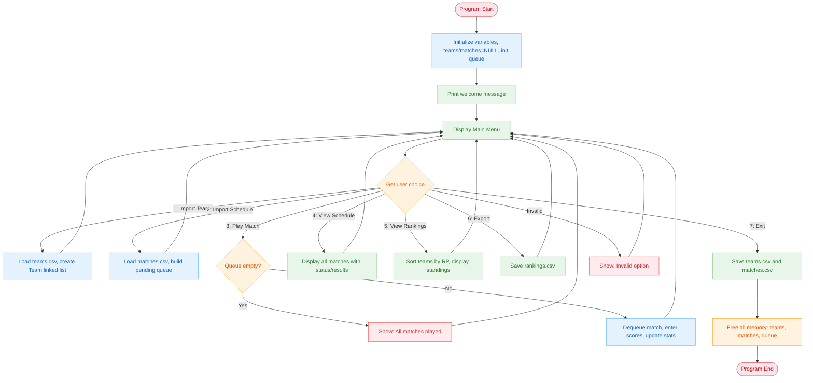
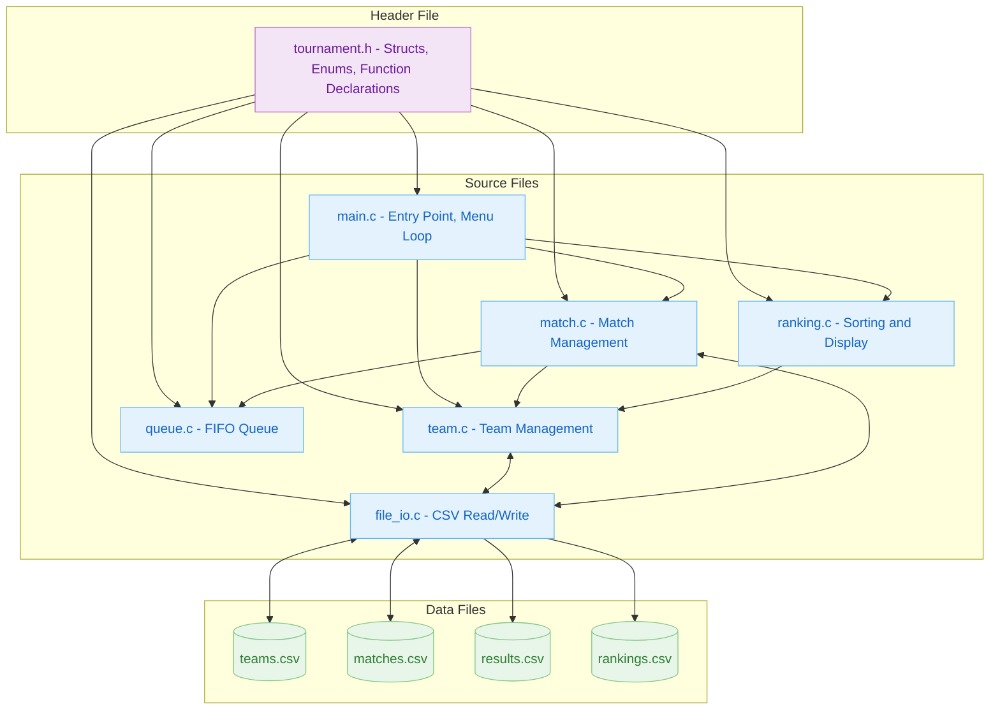

# Technical Report: FTC Tournament Management System (RMS)

**Student:** [Your Name]  
**Student ID:** [Your ID]  
**Course:** [Course Name]  
**Date:** 2026-04-01

---

## Table of Contents

1. [Introduction](#1-introduction)
2. [Project Overview](#2-project-overview)
3. [System Design](#3-system-design)
   - [3.1 Overall Flowchart](#31-overall-flowchart)
   - [3.2 Module Architecture](#32-module-architecture)
   - [3.3 Algorithms](#33-algorithms)
   - [3.4 Implementation](#34-implementation)
4. [Testing](#4-testing)
5. [Requirements Mapping](#5-requirements-mapping)
6. [Conclusion](#6-conclusion)

---

## 1. Introduction

The FTC Tournament Management System (RMS) is a console-based C application designed to manage robotics tournament operations. The system handles team registration, match scheduling, score entry, and live rankings calculation. All data is persisted using CSV files for portability and human readability.

**Key Features:**
- Import teams from CSV files
- Load and manage match schedules
- Enter match scores with real-time ranking updates
- View match schedules and results
- Export final rankings to CSV

---

## 2. Project Overview

### 2.1 Objectives

- Implement a complete tournament management workflow
- Use dynamic memory allocation for all data structures
- Implement a FIFO queue using linked lists
- Perform file I/O operations (read, write, append)
- Create a modular, maintainable codebase

### 2.2 Constraints

- Console-based interface only (no GUI)
- Single-user operation
- Flat-file storage (CSV format)
- No network or database connectivity

---

## 3. System Design

### 3.1 Overall Flowchart

**Fig 1: System Flow from Start to Exit**



---

### 3.2 Module Architecture

**Fig 2: Module Interaction Diagram**



**File Descriptions:**

| File | Purpose | Key Functions |
|------|---------|---------------|
| `tournament.h` | Shared header with types and declarations | All structs, enums, function prototypes |
| `main.c` | Program entry point, menu loop | `main()`, `print_menu()` |
| `team.c` | Team linked list operations | `team_create()`, `team_find()`, `team_update_stats()` |
| `match.c` | Match linked list operations | `match_create()`, `match_enter_score()`, `match_print_all()` |
| `queue.c` | FIFO queue for pending matches | `queue_init()`, `queue_enqueue()`, `queue_dequeue()` |
| `ranking.c` | Sorting and display | `ranking_sort()`, `ranking_display()` |
| `file_io.c` | CSV file operations | `file_load_teams()`, `file_save_matches()`, `file_append_result()` |

---

### 3.3 Algorithms

#### Algorithm 1: Team Search (Linear Search on Linked List)

**Fig 3.1: team_find()**

```
FUNCTION team_find(head, target_id):
    curr ← head
    WHILE curr is not NULL:
        IF curr.id equals target_id:
            RETURN curr
        curr ← curr.next
    RETURN NULL
```

- **Time Complexity:** O(n) where n = number of teams
- **Space Complexity:** O(1)
- **Location:** `team.c` lines 12-19

---

#### Algorithm 2: Ranking Sort (qsort with Custom Comparator)

**Fig 3.2: ranking_sort()**

```
FUNCTION compare_teams(a, b):
    ta ← Team pointer from a
    tb ← Team pointer from b
    
    IF tb.ranking_points not equal ta.ranking_points:
        RETURN tb.rp - ta.rp       // Higher RP first
    
    IF tb.total_score not equal ta.total_score:
        RETURN tb.score - ta.score // Higher score first
    
    RETURN ta.id - tb.id           // Lower ID first (tiebreaker)

FUNCTION ranking_sort(head, count):
    count ← 0
    curr ← head
    WHILE curr is not NULL:
        count ← count + 1
        curr ← curr.next
    
    IF count equals 0:
        RETURN NULL
    
    arr ← MALLOC(count × sizeof(Team*))
    i ← 0
    curr ← head
    WHILE curr is not NULL:
        arr[i] ← curr
        i ← i + 1
        curr ← curr.next
    
    QSORT(arr, count, sizeof(Team*), compare_teams)
    RETURN arr
```

- **Time Complexity:** O(n log n) for sorting
- **Space Complexity:** O(n) for the array
- **Location:** `ranking.c` lines 3-36

---

#### Algorithm 3: Queue Enqueue (FIFO Insertion)

**Fig 3.3: queue_enqueue()**

```
FUNCTION queue_enqueue(q, match):
    node ← MALLOC(sizeof(QueueNode))
    node.match ← match
    node.next ← NULL
    
    IF q.rear is not NULL:
        q.rear.next ← node
    ELSE:
        q.front ← node
    
    q.rear ← node
    q.size ← q.size + 1
```

- **Time Complexity:** O(1)
- **Space Complexity:** O(1) per node
- **Location:** `queue.c` lines 9-22

---

#### Algorithm 4: Queue Dequeue (FIFO Removal)

**Fig 3.4: queue_dequeue()**

```
FUNCTION queue_dequeue(q):
    IF q.front is NULL:
        RETURN NULL
    
    node ← q.front
    match ← node.match
    q.front ← node.next
    
    IF q.front is NULL:
        q.reear ← NULL
    
    FREE node
    q.size ← q.size - 1
    RETURN match
```

- **Time Complexity:** O(1)
- **Space Complexity:** O(1)
- **Location:** `queue.c` lines 24-37

---

#### Algorithm 5: Update Team Stats

**Fig 3.5: team_update_stats()**

```
FUNCTION team_update_stats(team, my_score, opp_score):
    IF team is NULL:
        RETURN
    
    team.matches_played ← team.matches_played + 1
    team.total_score ← team.total_score + my_score
    
    IF my_score > opp_score:
        team.wins ← team.wins + 1
        team.ranking_points ← team.ranking_points + 3
    ELSE IF my_score equals opp_score:
        team.ties ← team.ties + 1
        team.ranking_points ← team.ranking_points + 1
    ELSE:
        team.losses ← team.losses + 1
        team.ranking_points ← team.ranking_points + 0
```

- **Time Complexity:** O(1)
- **Space Complexity:** O(1)
- **Location:** `team.c` lines 31-45

---

#### Algorithm 6: Load Teams from CSV

**Fig 3.6: file_load_teams()**

```
FUNCTION file_load_teams(path, count):
    file ← OPEN(path, "r")
    IF file is NULL:
        RETURN NULL
    
    head ← NULL, tail ← NULL
    count ← 0
    SKIP header line
    
    WHILE NOT EOF:
        READ line
        PARSE id, name FROM line
        IF parse successful:
            t ← team_create(id, name)
            IF head is NULL:
                head ← t, tail ← t
            ELSE:
                tail.next ← t
                tail ← t
            count ← count + 1
    
    CLOSE file
    RETURN head
```

- **Time Complexity:** O(n) where n = number of rows
- **Space Complexity:** O(n) for all team nodes
- **Location:** `file_io.c` lines 3-40

---

### 3.4 Implementation

#### Memory Allocation (malloc/calloc)

All dynamic data structures use heap allocation:

```c
// team.c line 4: Team creation
Team *t = (Team *)calloc(1, sizeof(Team));

// match.c line 4: Match creation  
Match *m = (Match *)calloc(1, sizeof(Match));

// queue.c line 10: Queue node allocation
QueueNode *node = (QueueNode *)malloc(sizeof(QueueNode));

// ranking.c line 24: Array for sorting
Team **arr = (Team **)malloc(*count * sizeof(Team *));
```

---

#### Memory Deallocation (free)

All allocated memory is freed before program exit:

```c
// team.c lines 47-54: Free team list
void team_free_list(Team *head) {
    Team *curr = head;
    while (curr) {
        Team *next = curr->next;
        free(curr);
        curr = next;
    }
}

// queue.c lines 58-66: Free queue
void queue_free(MatchQueue *q) {
    while (q->front) {
        QueueNode *node = q->front;
        q->front = node->next;
        free(node);
    }
}

// main.c lines 88-90: Cleanup on exit
team_free_list(teams);
match_free_list(matches);
queue_free(&queue);
```

---

#### File I/O Operations

```c
// file_io.c lines 3-40: Read teams from CSV
Team *file_load_teams(const char *path, int *count) {
    FILE *f = fopen(path, "r");
    // ... read and parse ...
    fclose(f);
    return head;
}

// file_io.c lines 42-55: Write teams to CSV
void file_save_teams(Team *head, const char *path) {
    FILE *f = fopen(path, "w");
    fprintf(f, "team_id,team_name,rp,wins,ties,losses,total_score\n");
    // ... write each team ...
    fclose(f);
}

// file_io.c lines 128-138: Append match result
void file_append_result(const char *path, int match_num, ...) {
    FILE *f = fopen(path, "a");
    if (!f) {
        f = fopen(path, "w");
        fprintf(f, "header...\n");
    }
    fprintf(f, "%d,%d,%d,%d,%d,%s\n", ...);
    fclose(f);
}
```

---

#### Linked List Operations

```c
// Singly linked list traversal (team.c lines 12-19)
Team *team_find(Team *head, int id) {
    Team *curr = head;
    while (curr) {
        if (curr->id == id) return curr;
        curr = curr->next;
    }
    return NULL;
}

// Queue using linked list (queue.c lines 9-22)
void queue_enqueue(MatchQueue *q, Match *m) {
    QueueNode *node = malloc(sizeof(QueueNode));
    node->match = m;
    node->next = NULL;
    if (q->rear) {
        q->rear->next = node;
    } else {
        q->front = node;
    }
    q->rear = node;
    q->size++;
}
```

---

## 4. Testing

### 4.1 Automated Report Cases

The report-level CLI checks are automated in `tests/run_report_cases.sh`.
They focus on import robustness, menu validation, and score-entry guardrails.

**Screenshot summary:** [fig/fig5_report_tests.svg](fig/fig5_report_tests.svg)

| Test ID | Feature | Input / Fixture | Expected Console Output | Status |
|---------|---------|-----------------|-------------------------|--------|
| TC-01 | Import Teams | `1 -> 7` with normal `data/teams.csv` | `Loaded 10 teams.` | PASS |
| TC-02 | Import Teams Missing File | `1 -> 7` with `data/teams.csv` absent | `Warning: Cannot open data/teams.csv` and `Failed to load teams. Keeping existing data.` | PASS |
| TC-03 | Import Teams Malformed Row | `1 -> 7` with malformed team row like `bad,row` | `Warning: Skipping malformed row: bad,row` and `Loaded 2 teams.` | PASS |
| TC-04 | Import Schedule | `2 -> 7` with normal `data/matches.csv` | `Loaded 20 matches (3 pending).` | PASS |
| TC-05 | Import Schedule Missing File | `2 -> 7` with `data/matches.csv` absent | `Warning: Cannot open data/matches.csv` and `Failed to load matches. Keeping existing data.` | PASS |
| TC-06 | Import Schedule Malformed Row | `2 -> 7` with malformed match row like `bad,row` | `Warning: Skipping malformed row: bad,row` and `Loaded 2 matches (1 pending).` | PASS |
| TC-07 | Invalid Main Menu Input | `abc -> 7` | `Invalid input. Please enter a number.` | PASS |
| TC-08 | Play Match Without Teams | `3 -> 7` | `No teams loaded. Please import teams first (option 1).` | PASS |
| TC-09 | Play Match Without Schedule | `1 -> 3 -> 7` with no `data/matches.csv` fixture | `No matches loaded. Please import the schedule first (option 2).` | PASS |
| TC-10 | Invalid Score Input | `1 -> 2 -> 3 -> a -> 7` | `Invalid score input. Match not recorded.` | PASS |

---

### 4.2 Sample Test Execution

**Test: Import Teams (TC-01)**
```text
$ ./tournament
Welcome to Robotics Tournament Manager!

========================================
   ROBOTICS TOURNAMENT MANAGEMENT SYSTEM
========================================
 [1] Import Teams from CSV
 [2] Import Match Schedule from CSV
 [3] Play Next Match (Enter Scores)
 [4] View Match Schedule & Results
 [5] View Rankings
 [6] Export Rankings to CSV
 [7] Exit
========================================
Select option: 1
Loaded 10 teams.
```

**Test: Import Schedule Malformed Row (TC-06)**
```text
Select option: 2
Warning: Skipping malformed row: bad,row
Loaded 2 matches (1 pending).
```

**Test: Invalid Main Menu Input (TC-07)**
```text
Select option: abc
Invalid input. Please enter a number.
```

**Test: Invalid Score Input (TC-10)**
```text
Select option: 3
Match 3: Blue Thunder (RED) vs Green Force (BLUE)
Enter RED score: Invalid score input. Match not recorded.
```

---

## 5. Requirements Mapping

### 5.1 Academic Requirements

| Requirement | Implementation | Location |
|-------------|----------------|----------|
| **Dynamic Memory (malloc/calloc)** | `calloc()` for Team, Match; `malloc()` for QueueNode, sorting array | `team.c:4`, `match.c:4`, `queue.c:10`, `ranking.c:24` |
| **Memory Deallocation (free)** | `team_free_list()`, `match_free_list()`, `queue_free()`, `ranking_free_sorted()` | `team.c:47-54`, `match.c:79-86`, `queue.c:58-66` |
| **Singly Linked List** | Team*, Match* use `next` pointer | `tournament.h:43,53` |
| **Queue (FIFO) using Linked List** | MatchQueue with front/rear pointers | `queue.c:9-37` |
| **File I/O - Read** | `fopen("r")`, `fgets()`, `sscanf()` | `file_io.c:3-40`, `file_io.c:57-97` |
| **File I/O - Write** | `fopen("w")`, `fprintf()` | `file_io.c:42-55`, `file_io.c:99-112` |
| **File I/O - Append** | `fopen("a")` with fallback to create | `file_io.c:128-138` |
| **Sorting Algorithm** | `qsort()` with custom comparator | `ranking.c:14-36` |
| **Search Algorithm** | Linear search on linked list | `team.c:12-19`, `match.c:13-20` |
| **Multiple Modules** | 6 source files + 1 header | `src/*.c`, `include/tournament.h` |
| **Makefile Build** | `gcc -Wall -Wextra` compilation | `Makefile` |

---

### 5.2 Code Statistics

| Metric | Value |
|--------|-------|
| Total Lines of Code | ~600+ |
| Number of Source Files | 6 (.c files) |
| Number of Header Files | 1 (.h file) |
| Number of Functions | 25+ |
| Dynamic Allocations | 4 (Team, Match, QueueNode, Team**) |

---

## 6. Conclusion

The FTC Tournament Management System successfully demonstrates:

1. **Dynamic Memory Management** - All data structures are heap-allocated and properly freed
2. **Data Structures** - Singly linked lists for teams/matches, FIFO queue for match scheduling
3. **File Persistence** - CSV read/write/append operations for data storage
4. **Modular Design** - Clean separation of concerns across 6 source files
5. **User Interface** - Intuitive menu-driven console interface

The system provides a complete tournament management workflow suitable for FTC-style robotics competitions with minimal resource requirements.

---

## Appendix A: Build Instructions

```bash
# Build the project
cd rms_project
make

# Run the program
./tournament

# Clean build artifacts
make clean
```

## Appendix B: File Formats

**teams.csv:**
```csv
team_id,team_name,rp,wins,ties,losses,total_score
1001,Red Dragons,9,3,0,0,312
```

**matches.csv:**
```csv
match_num,red_team_id,blue_team_id,red_score,blue_score,status
1,1001,1002,100,56,1
```

**results.csv:**
```csv
match_num,red_team_id,blue_team_id,red_score,blue_score,winner
1,1001,1002,100,56,RED
```

**rankings.csv:**
```csv
rank,team_id,team_name,rp,wins,ties,losses,total_score
1,1001,Red Dragons,9,3,0,0,312
```
